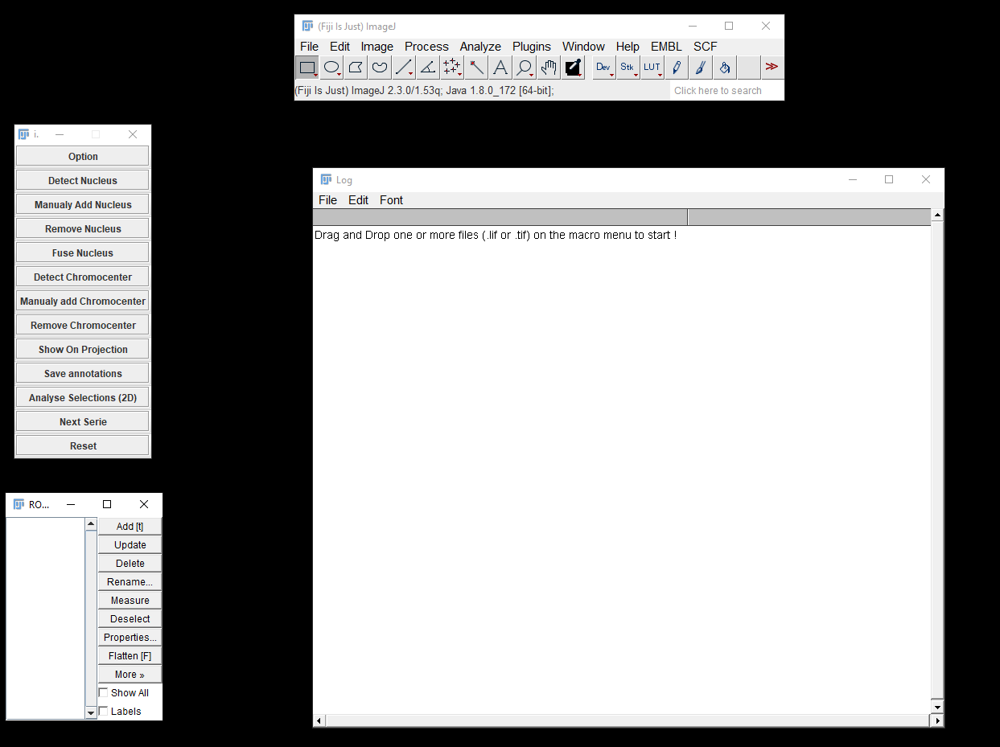
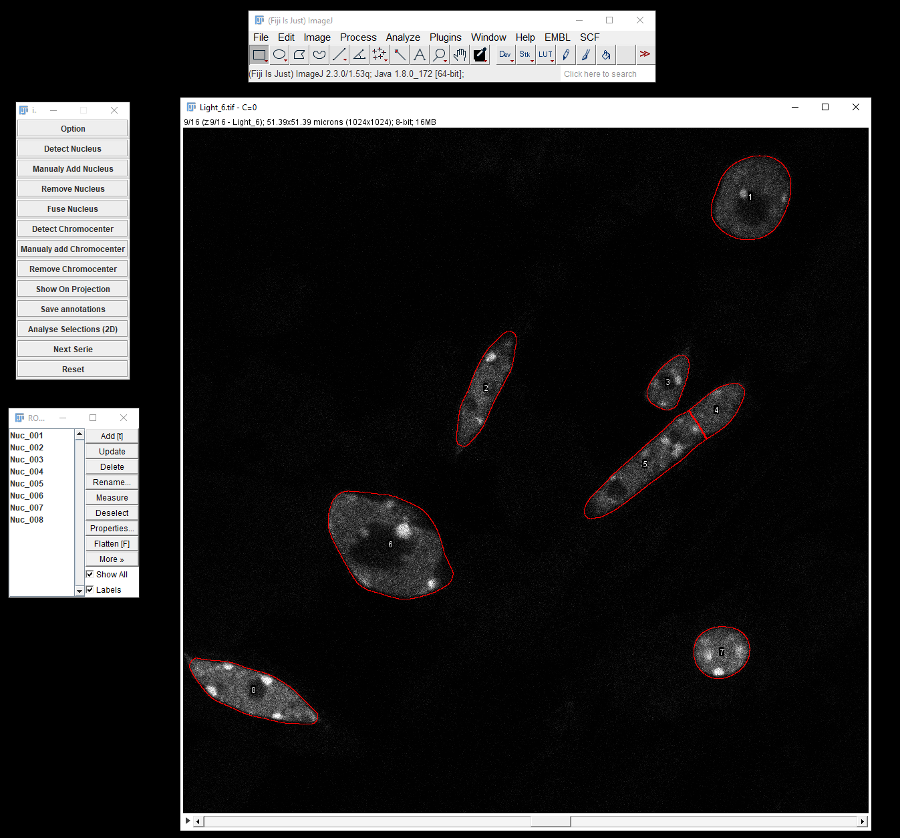
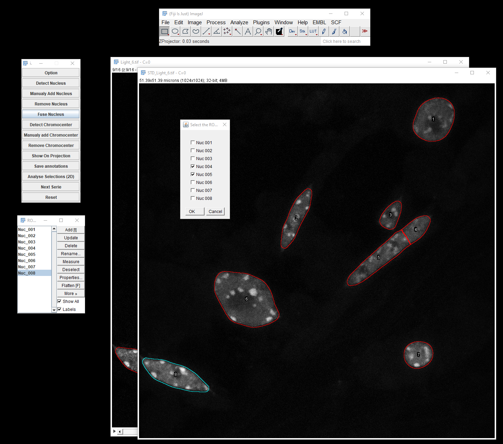
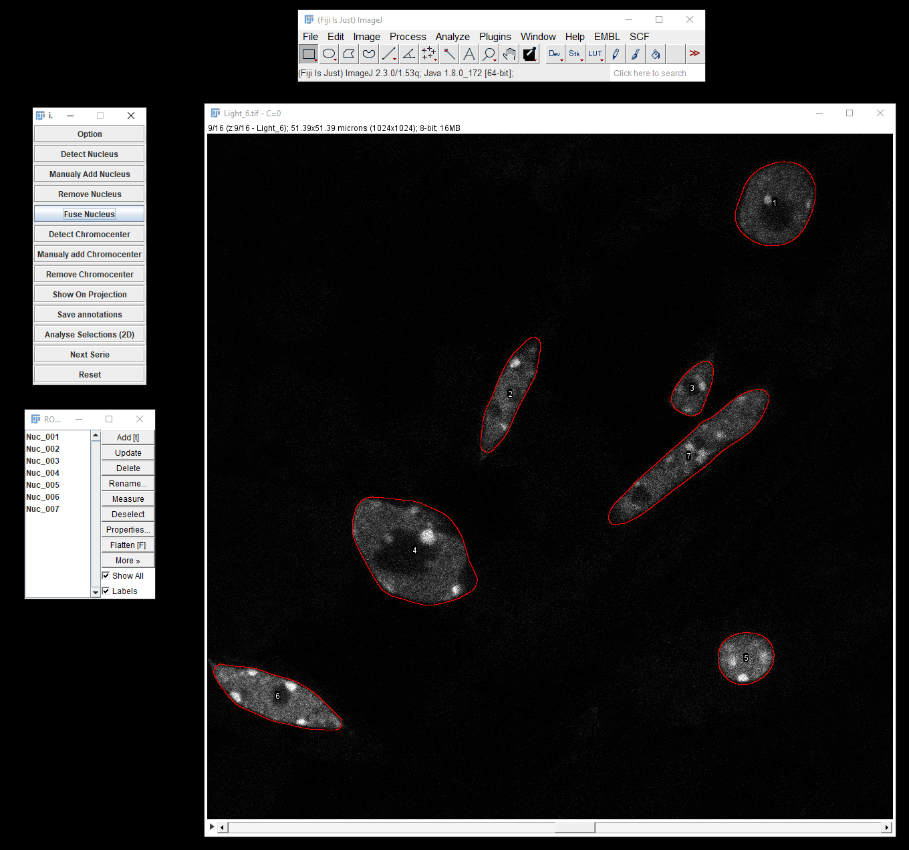
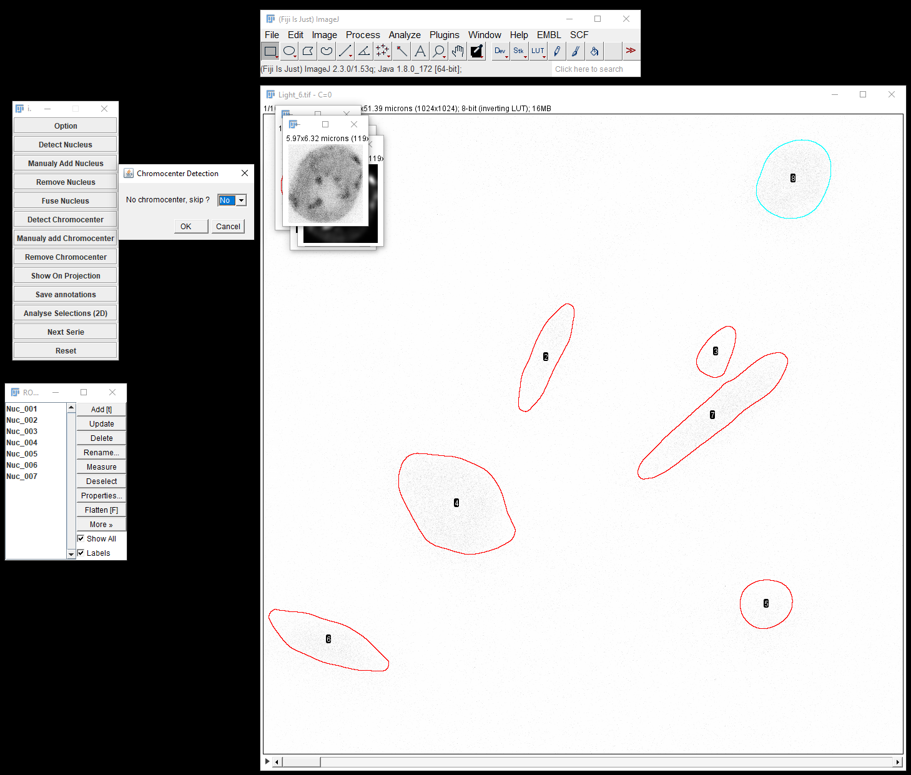
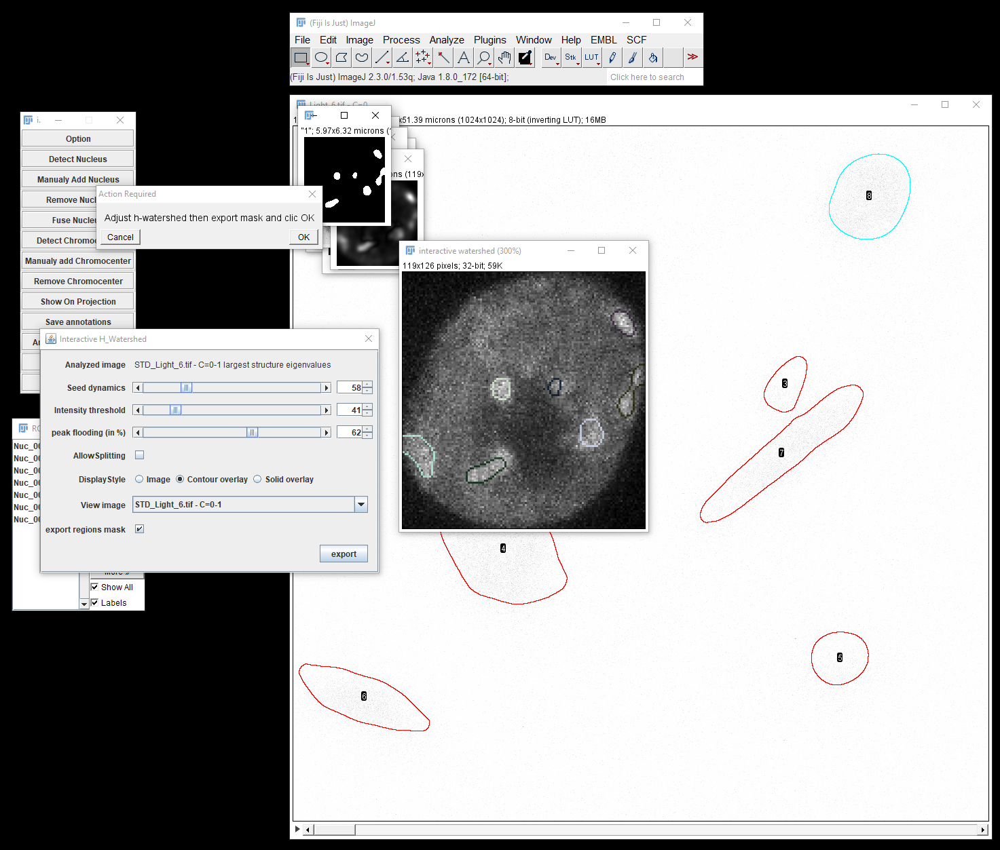
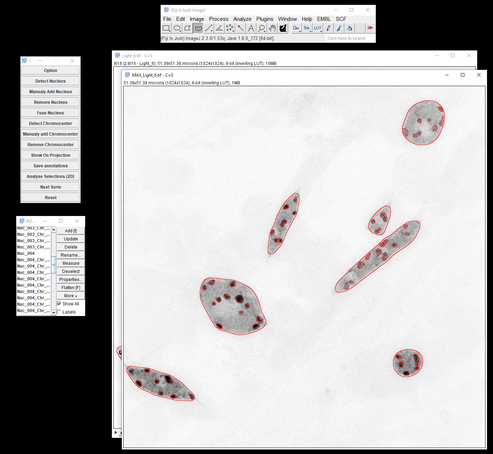
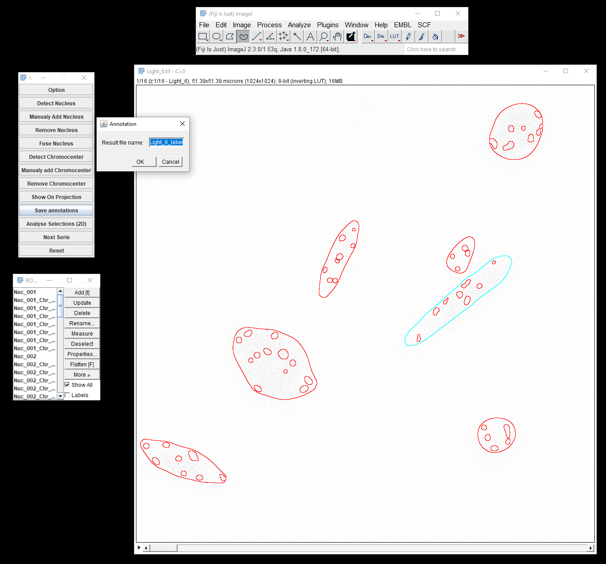
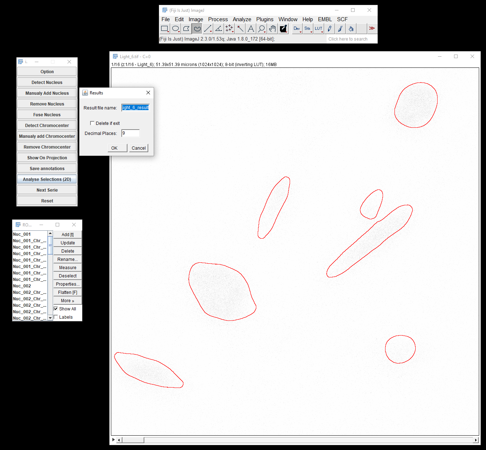

# iCRAQ
ImageJ macro developed to analyse chromocenters in plant nucleus[^1]
[^1]: This macro was developed during an internship in IBENS under the supervision of Fredy Barneche and Clara Bourbousse.

This macros rely on [**ActionBar**](https://figshare.com/articles/Custom_toolbars_and_mini_applications_with_Action_Bar/3397603), [**ImageScience**](https://sites.imagej.net/ImageScience/) and [**SCF MPI CBG**](https://sites.imagej.net/SCF-MPI-CBG/) plugins.

To run iCRAQ place `iCRAQ_main.txt` in a folder named "iCRAQ" inside the macros folder of ImageJ, launch ImageJ then go into *Plugins>>Macros>>Run...* and choose the `iCRAQ_main.txt` file:

* **drag and drop** one (or more) `.tif` (or `.lif`) files of microscopy z-stack on the iCRAQ buttons menu, the macro will open the first file (or the first serie of the first `.lif` file)
* Tune the options via the **Option** button if needed (see the `options.txt` for more details)
* Proceed with the nucleus detection by clicking on **Detect Nucleus**:

* Missed nuclei can be **added** (one at a time) by clicking on the **Manualy Add Nucleus** button and then using the *freehand* tool (or any other ROI drawing tools)
* Unwanted nuclei ROIs can also be **removed** (one at a time) with the **Remove Nucleus** button and then choosing the ROI of the unwanted nucleus in the *Roi manager*
* **Fuse Nucleus** button is mainly used to **fuse** elongated nuclei that have been cut by the nucleus detection process or to group nuclei to be removed:

* Proceed with the chromocenter detection hitting the **Detect Chromocenter** button
* Each detected nuclei will be analysed **separatedly**
* A first dialog panel allows to **skip** the chromocenter detection of the current nucleus by answering *Yes*:

* Otherwise you will be asked to adjust the **sliders** in the *H-watershed* plugin to get a good segmentation of the chromocenters:[^2][^3]

[^2]: Tips: change the display style to `Contour overlay`, uncheck the `Allow Splitting` box, tune the `Seed dynamics` to have one watershed region per chromocenter, adjust the `Intensity threshold` to fit to the chromocenter and finaly decrease the `peak flooding` if needed
[^3]: The `View image` in the *H-watershed* plugin menu allow to choose between the chromocenter *features* image (corresponding to the projection of the first eigenvalue of the structure tensor) or the projection of the original stack
* Then **export** the chromocenters mask via the *H-watershed* plugin menu and click *Ok* on the pop-up window to proceed to the next nucleus[^4]
[^4]: Note that the *H-watershed* plugin run in a java window that cannot be closed easily via ImageJ macro language, and the plugin windows will accumulate.
* As for nuclei, missed chromocenter can be **added** manualy with the **Manualy add Chromocenter** button and first selecting the nucleus *ROI* from which the missed chromocenter belong to and then drawing it manualy
* Chromocenters can also be **removed** with the **Remove Chromocenter** button and clicking the *ROI* of the unwanted chromocenter.
* Quality of the segmentation can be shown on the 2D projection via the **Show On Projection** button before performing the quantification (**close the projection before running the quantification**):

* The segmentation can then be saved using **Save annotations** which will first ask the name of the annotation image, then the destination folder and will save a `.tif` image with 2 or 3 gray levels:[^5]
[^5]: The gray levels will be: `0` for **background**, `128` for **nuclei** and `255` for **chromocenter** if chromocenter are present in the image, or `0` for the **background** and `255` for the **nuclei** if no chromocenter are prensent.

* Finaly, the **Analyse Selections (2D)** will ask for a result file name, perform the quantification of different *ROI* parameters and save the informations in 2 separate `.txt` files one with **nuclei** informations (including the number of chromocenter then contains and the RHF, RAF...) and another one with each **chromocenter** informations[^6]
[^6]: The measured *ROI* parameters includes: the `x`, `y` position in the image, the `area`, `mean` and `standard deviation`of gray level, the raw and normalized `sum intensity` and shapes descriptor (`roundness`, `circularity`, `aspect ratio` and `solidity`).
* Note that the data from **different images** corresponding to the **same serie** can be appended in one **unique** file by providing the same result file name and **not** checking the `Delete if exit` option

* The **Next Serie** button will **close** the current image and **open** the next one in the queue
* The **Reset** button **remove** all *ROI* and reset the number of nuclei detected to 0
